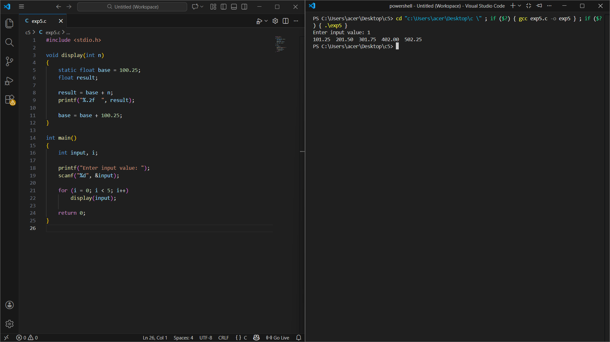
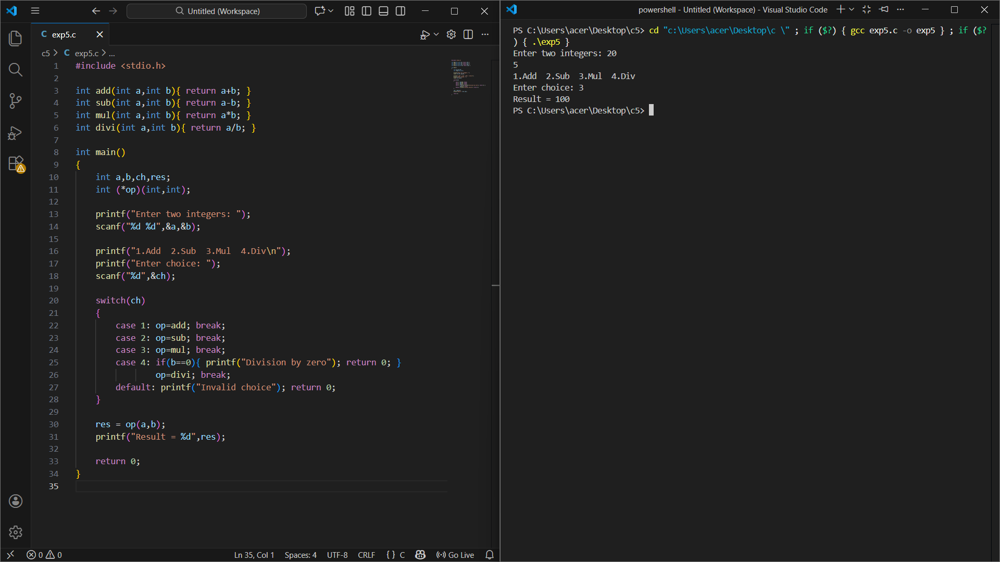
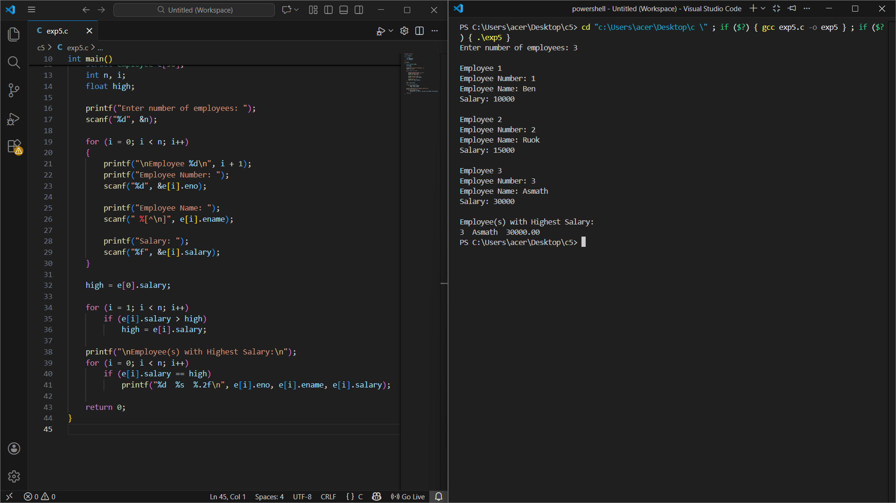
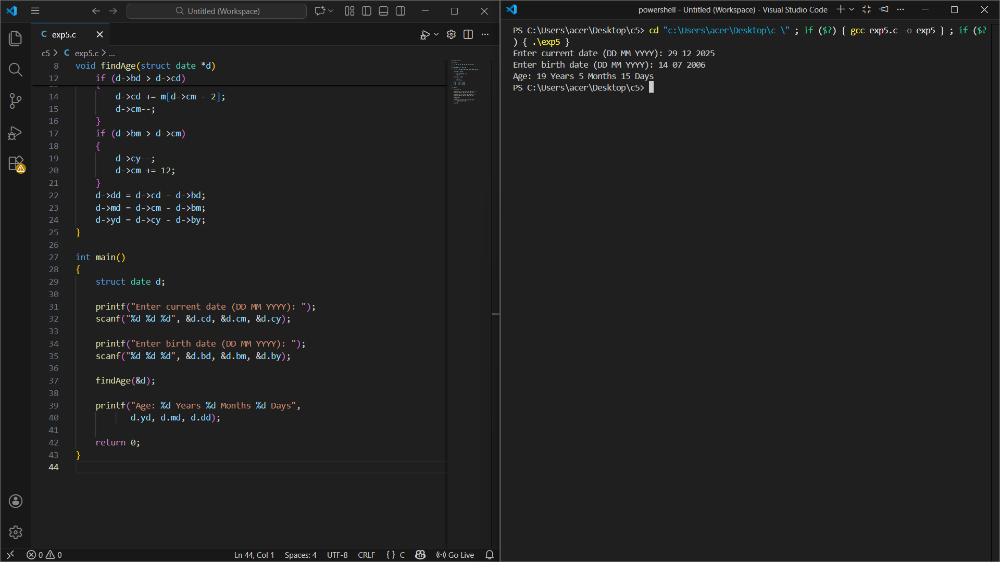

# 19AI304-Fundamentals-of-C-Programming-2025-Odd-M6
# IAPR-6- Module 6 - FoC
## 11. Implementation of the concept of pointer to function.
## 12. Implementation of programs using structure and union.
## 13. Implementation of programs for different storage classes.
# Ex.No:26
  Develop a C program using static storage class in function with parameter and without return to display the incremental float values as indicated in the following output.
| Input | Output                                       |
|-------|----------------------------------------------|
| 1     | 101.25&nbsp;&nbsp;201.50&nbsp;&nbsp;301.75&nbsp;&nbsp;402.00&nbsp;&nbsp;502.75 |
# Date : 18/12/2025
# Aim:
To develop a C program using the static storage class in a function with a parameter and without a return value to display the required output.
# Algorithm:
### Step 1:
  Start
### Step 2: 
  Include the standard input-output library: #include<stdio.h>.
### Step 3:
  a. Declare an integer variable `input` to store the user’s number.  
  b. Inside the function `display(int n)`, declare a static float variable `base` and initialize it to 100.25.
### Step 4:
  Read an integer from the user and store it in `input`.
### Step 5:
  Call the function `display(input)` five times.
### Step 6:
  Inside the `display` function, for each call:  
  a. Calculate the sum of `base` and `n`.  
  b. Display the value.  
  c. Increase the value of `base` by 100.25.
### Step 7:
  Repeat Step 6 for all function calls.
### Step 8:
  Stop
# Program:
```
#include <stdio.h>

void display(int n)
{
    static float base = 100.25;
    float result;

    result = base + n;
    printf("%.2f  ", result);

    base = base + 100.25;
}

int main()
{
    int input, i;

    printf("Enter input value: ");
    scanf("%d", &input);

    for (i = 0; i < 5; i++)
        display(input);

    return 0;
}
```
# Output:

# Result: 
Thus, the program was implemented and executed successfully, and the required output was obtained.


# 19AI304-Fundamentals-of-C-Programming-2025-Odd-M6
# IAPR-6- Module 6 - FoC
# Ex.No:27
  Implement a C program to perform arithmetic operations (addition, subtraction, multiplication, division) on two integers using function pointers. The user should input two numbers and select the desired operation from a menu.
# Date : 18/12/2025
# Aim:
  To implement a C program that uses function pointers to perform arithmetic operations (add, subtract, multiply, divide) on two integers based on user choice.
# Algorithm:
### Step 1:
  Start
### Step 2: 
  Include the standard input-output library: #include<stdio.h>.
### Step 3:
  Declare four functions to perform arithmetic operations:  
  - `add(int a, int b)`  
  - `subtract(int a, int b)`  
  - `multiply(int a, int b)`  
  - `divide(int a, int b)`
### Step 4:
  Declare a function pointer `int (*operation)(int, int)` to point to any of the arithmetic functions.
### Step 5:
  Input two integers from the user (`num1` and `num2`).
### Step 6:
  Display a menu for the user to choose an operation:  
  - Add  
  - Subtract  
  - Multiply  
  - Divide
### Step 7:
  Read the user’s choice.
### Step 8:
  Use a switch statement to assign the function pointer `operation` to the appropriate function based on the user’s choice.  
  - **Step 8.1:** If the choice is 4 (divide), check if the second number is zero. If yes, display an error and terminate.  
  - **Step 8.2:** If the choice is invalid, display an error and terminate.
### Step 9:
  Call the function using the function pointer and store the result in a variable `result`.
### Step 10:
  Display the result.
### Step 11:
  Stop
# Program:
```
#include <stdio.h>

int add(int a,int b){ return a+b; }
int sub(int a,int b){ return a-b; }
int mul(int a,int b){ return a*b; }
int divi(int a,int b){ return a/b; }

int main()
{
    int a,b,ch,res;
    int (*op)(int,int);

    printf("Enter two integers: ");
    scanf("%d %d",&a,&b);

    printf("1.Add  2.Sub  3.Mul  4.Div\n");
    printf("Enter choice: ");
    scanf("%d",&ch);

    switch(ch)
    {
        case 1: op=add; break;
        case 2: op=sub; break;
        case 3: op=mul; break;
        case 4: if(b==0){ printf("Division by zero"); return 0; }
                op=divi; break;
        default: printf("Invalid choice"); return 0;
    }

    res = op(a,b);
    printf("Result = %d",res);

    return 0;
}
```
# Output:

# Result: 
Thus, the program was implemented and executed successfully, and the required output was obtained.

# 19AI304-Fundamentals-of-C-Programming-2025-Odd-M6
# IAPR-6- Module 6 - FoC
# Ex.No:28
  Develop a C program to store details of n employees (employee number, name, and salary) using structures, and display the employee(s) with the highest salary.
# Date : 18/12/2025
# Aim:
  To develop and implement a C program that uses a structure to store employee details (employee number, name, and salary) and determine the employee(s) with the highest salary.
# Algorithm:
### Step 1:
  Start
### Step 2: 
  Include the standard input-output library: #include<stdio.h>.
### Step 3:
  Define a structure `employee` with the following members:  
  - `eno` (employee number)  
  - `ename` (employee name)  
  - `salary` (employee salary)
### Step 4:
  Declare an array of structures to store details of multiple employees.
### Step 5:
  Input the number of employees, `n`.
### Step 6:
  For each employee (`i = 0` to `n-1`), do the following:  
  - **Step 6.1:** Input employee number.  
  - **Step 6.2:** Input employee name (allow spaces).  
  - **Step 6.3:** Input employee salary.  
  - **Step 6.4 (Optional):** Print the entered details for verification.
### Step 7:
  Initialize a variable `high` with the salary of the first employee.
### Step 8:
  For each employee (`i = 1` to `n-1`), do the following:  
  - **Step 8.1:** Compare employee salary with `high`.  
  - **Step 8.2:** If the salary is greater than `high`, update `high` with this salary.
### Step 9:
  Print the details of employee(s) whose salary matches `high`:  
  - **Step 9.1:** Loop through all employees.  
  - **Step 9.2:** If employee salary equals `high`, print employee number, name, and salary.
### Step 10:
  Stop
# Program:
```
#include <stdio.h>

struct employee
{
    int eno;
    char ename[50];
    float salary;
};

int main()
{
    struct employee e[50];
    int n, i;
    float high;

    printf("Enter number of employees: ");
    scanf("%d", &n);

    for (i = 0; i < n; i++)
    {
        printf("\nEmployee %d\n", i + 1);
        printf("Employee Number: ");
        scanf("%d", &e[i].eno);

        printf("Employee Name: ");
        scanf(" %[^\n]", e[i].ename);

        printf("Salary: ");
        scanf("%f", &e[i].salary);
    }

    high = e[0].salary;

    for (i = 1; i < n; i++)
        if (e[i].salary > high)
            high = e[i].salary;

    printf("\nEmployee(s) with Highest Salary:\n");
    for (i = 0; i < n; i++)
        if (e[i].salary == high)
            printf("%d  %s  %.2f\n", e[i].eno, e[i].ename, e[i].salary);

    return 0;
}
```
# Output:

# Result: 
Thus, the program was implemented and executed successfully, and the required output was obtained.


# 19AI304-Fundamentals-of-C-Programming-2025-Odd-M6
# IAPR-6- Module 6 - FoC
# Ex.No:29
  Create the C program to calculate the present age of a person by passing structure as a reference.
# Date : 18/12/2025
# Aim:
  To create a C program that uses a structure to store the current date and birth date, and to calculate the person’s present age in years, months, and days by passing the structure as a reference.
# Algorithm:
### Step 1:
  Start
### Step 2: 
  Include the standard input-output library: #include<stdio.h>.
### Step 3:
  Define a structure named `date` with members to store:  
  - Current date (`c_date`, `c_month`, `c_year`)  
  - Birth date (`b_date`, `b_month`, `b_year`)  
  - Calculated age (`cal_date`, `cal_month`, `cal_year`)
### Step 4:
  Initialize a structure variable with the current date and birth date values.
### Step 5:
  Pass the structure variable to a function `findAge()` by reference.
### Step 6:
  Inside `findAge()`:  
  - a. Declare an integer array `month[]` to store the number of days in each month.  
  - b. If the birth date is greater than the current date:  
     - Add the number of days of the previous month to the current date.  
     - Decrease the current month by 1.  
  - c. If the birth month is greater than the current month:  
     - Decrease the current year by 1.  
     - Add 12 to the current month.  
  - d. Calculate the age in days, months, and years by subtracting the corresponding birth values from the current values.
### Step 7:
  Return the structure pointer containing the calculated age.
### Step 8:
  Display the calculated age (years, months, and days) in the `main` function.
### Step 9:
  Stop
# Program:
```
#include <stdio.h>

struct date
{
    int cd, cm, cy, bd, bm, by, yd, md, dd;
};

void findAge(struct date *d)
{
    int m[] = {31,28,31,30,31,30,31,31,30,31,30,31};

    if (d->bd > d->cd)
    {
        d->cd += m[d->cm - 2];
        d->cm--;
    }
    if (d->bm > d->cm)
    {
        d->cy--;
        d->cm += 12;
    }
    d->dd = d->cd - d->bd;
    d->md = d->cm - d->bm;
    d->yd = d->cy - d->by;
}

int main()
{
    struct date d;

    printf("Enter current date (DD MM YYYY): ");
    scanf("%d %d %d", &d.cd, &d.cm, &d.cy);

    printf("Enter birth date (DD MM YYYY): ");
    scanf("%d %d %d", &d.bd, &d.bm, &d.by);

    findAge(&d);

    printf("Age: %d Years %d Months %d Days",
           d.yd, d.md, d.dd);

    return 0;
}
```
# Output:

# Result: 
Thus, the program was implemented and executed successfully, and the required output was obtained.


# 19AI304-Fundamentals-of-C-Programming-2025-Odd-M6
# IAPR-6- Module 6 - FoC
# Ex.No:30
  Build a C program to demonstrate the use of a pointer to a union. Store an integer value in a union, access it using a union pointer, and display it as both an integer and a character.
# Date : 18/12/2025
# Aim:
  To build a program in C that uses a pointer to a union to store an integer value and display it in both integer and character format.
# Algorithm:
### Step 1:
  Start
### Step 2: 
  Include the standard input-output library: #include<stdio.h>.
### Step 3:
  Define a union `abc` with the following members:  
  - `int a`  
  - `char b`
### Step 4:
  Declare a union variable `var` of type `abc`.
### Step 5:
  Declare a pointer `ptr` of type `union abc*`.
### Step 6:
  Assign the address of `var` to `ptr`.
### Step 7:
  Store an integer value (e.g., 90) in `var.a`.
### Step 8:
  Access and print the value of `a` using the pointer `ptr` in integer format.
### Step 9:
  Access and print the same value using the pointer `ptr` in character format.
### Step 10:
  Stop
# Program:
```
#include <stdio.h>

union abc
{
    int a;
    char b;
};

int main()
{
    union abc var;
    union abc *ptr;

    ptr = &var;
    var.a = 90;

    printf("Integer value: %d\n", ptr->a);
    printf("Character value: %c", ptr->b);

    return 0;
}
```
# Output:

# Result: 
Thus, the program was implemented and executed successfully, and the required output was obtained.


